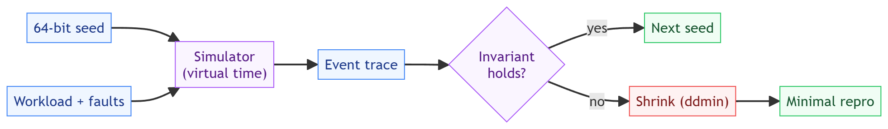

# deterministic-sim-testing: design, trade-offs, and non-goals

Status: accepted
Author: Parag Sawant

Why deterministic-sim-testing is built the way it is. The whole value proposition is a single
sentence — *a run is a pure function of one 64-bit seed* — so most of the design
is about protecting that property, and being honest about the one big thing this
does **not** do.

## Problem and goals

The bugs worth catching in distributed code are timing-dependent: a message
arrives late, a node crashes between two writes, a partition heals at the wrong
moment. Running the real system in a loop almost never reproduces them, and when
it does, you can't reproduce it *again*. Goals:

1. Execute message-passing logic **deterministically** — same input, same run,
   every time, on any machine.
2. Make a failure **replayable from one seed**, so a red CI run hands you an
   exact reproducer rather than "it flaked."
3. **Shrink** a failing fault schedule to the minimal set of faults that still
   triggers the bug, because a 40-fault reproducer is nearly useless to a human.

## Key design decision: one thread, virtual time, one PRNG

*(The same diagram renders inline as Mermaid in the [README](README.md#how-it-works); this PNG is a static export.)*

The engine is a single-threaded discrete-event loop over an integer virtual
clock. There are no OS threads and no wall-clock reads anywhere in the core. Every
source of nondeterminism a real system has is funnelled through two things: the
event heap (which orders what happens when) and a seeded splitmix64 PRNG (which
decides latency, loss, and fault timing).

That's the entire trick. Because the only inputs are the seed, the workload, and
the fault schedule — and all three are deterministic — the output event trace is
a pure function of them. The determinism tests assert exactly this: two runs with
the same seed produce byte-identical traces.

## The places determinism could leak (and how they're closed)

- **Tie-breaking between simultaneous events.** Two events scheduled for the same
  virtual tick must fire in a fixed order. The heap key is `(time, seq)` where
  `seq` is a monotonic insertion counter, so ties resolve deterministically
  instead of by heap-internal chance.
- **PRNG choice.** `random.random()` is off the table — its stream can change
  across interpreter versions. splitmix64 is a handful of lines and reproducible
  anywhere, which also keeps the door open to matching the stream in a future
  non-Python port.
- **Latency draws vs. loss draws.** Enabling random drop must not silently shift
  the latency stream, or turning loss on would change every delay after it. So a
  drop draw is only taken when `drop_prob > 0`; otherwise the delay is the only
  draw per send.
- **Crash-in-flight.** A node can crash while a message is travelling, so faults
  are checked twice — at send *and* at delivery. Checking only once would let a
  message land on a node the model considers down.

## Trade-offs I made on purpose

- **It simulates a model, not the binary.** Your code has to be written against
  the `Node` / `send` / `timer` interface so the simulator controls its clock and
  I/O. That's a real constraint, and it's the honest boundary of the approach —
  see non-goals.
- **Rebuild-free faults over a fault DSL.** Faults are plain frozen dataclasses
  with time windows, not a scripting language. Less expressive, but they're
  hashable and comparable, which is exactly what the shrinker needs to treat them
  as opaque items.
- **ddmin, not a smarter minimizer.** Delta debugging is O(n²) worst case and can
  get stuck at a local minimum. For fault schedules of a few dozen items that's
  irrelevant, and the algorithm is small enough to read and trust — which for a
  testing tool matters more than shaving passes.

## Non-goals

- **Not a syscall interceptor.** deterministic-sim-testing does not hook `gettimeofday`, real
  sockets, or the RNG of an arbitrary unmodified binary the way a hypervisor-level
  DST harness (Antithesis, FoundationDB's Flow) does. It runs *models* of your
  logic written against its interface. That's the honest limit: it finds bugs in
  the logic you port into it, not in code it can't see.
- **Not a performance simulator.** Virtual time is for ordering and reproducibility,
  not for predicting real latency or throughput of the modelled system.
- **Not multi-threaded.** Single-threaded execution is the whole point; it is not
  something to be optimized away with real parallelism.

## Benchmarks

See `BENCHMARKS.md`. Short version: the loop sustains tens of thousands of
scenarios per second on the sample workload, and replaying the same seeds a second
time costs within a few percent of the first pass — which is the number that
actually matters, because cheap deterministic replay is the whole reason to use it.
