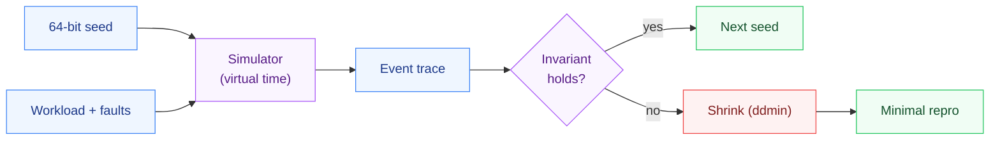

<h1 align="center">deterministic-sim-testing</h1>

<p align="center">Deterministic simulation testing for distributed code — run a message-passing system inside one deterministic thread, replay any run from a single 64-bit seed, and shrink a failing fault schedule to a minimal reproducer.</p>

---

## Why this exists

Concurrency bugs in distributed systems are the ones that ruin weekends: they need a specific interleaving of a message arriving late, a node crashing mid-write, and a partition healing at just the wrong moment. You can't reliably reproduce that by running the real thing in a loop.

deterministic-sim-testing borrows the approach FoundationDB and TigerBeetle use: run the system's logic in a single deterministic thread over *virtual* time, and route every source of nondeterminism — the clock, message latency, message loss, event ordering — through one seeded PRNG. A whole run then becomes a pure function of one 64-bit seed. Find a seed that breaks an invariant and you can replay that exact failure forever, on any machine.

## What it does

- **Deterministic event loop** — virtual-time discrete-event simulator; ties between simultaneous events break on insertion order, so concurrency is reproducible.
- **Seeded everything** — latency, drops, and fault timing all come from a small splitmix64 PRNG. Same seed ⇒ byte-identical event trace.
- **Fault injection** — partitions and crashes as first-class, hashable values with time windows, checked both when a message is sent and again when it's delivered.
- **Trace shrinking** — `ddmin` strips a failing fault schedule down to the one or two faults that actually matter.

## Quickstart

```python
from deterministic-sim-testing import Simulator, FaultSchedule, Partition, ddmin
from examples.replicated_flag import run_scenario, search_for_divergence

# 1. Find a seed whose fault schedule makes two replicas disagree.
seed, faults = search_for_divergence(range(500))

# 2. Replay it exactly, as many times as you like.
trace, diverged, values = run_scenario(seed, FaultSchedule.of(faults))
assert diverged

# 3. Shrink the schedule to the minimal reproducer.
minimal = ddmin(faults, lambda fs: run_scenario(seed, FaultSchedule.of(fs))[1])
print("minimal reproducer:", minimal)   # usually a single partition
```

## The worked example

`examples/replicated_flag.py` is a deliberately buggy workload: a coordinator sets a flag on two replicas with one fire-and-forget message each and **never retries**. Lose one of those messages and the replicas diverge silently. The test suite shows deterministic-sim-testing (a) finding a seed that triggers the divergence and (b) shrinking a padded fault schedule back down to the single fault responsible.

## Run it

```bash
pip install -e ".[dev]"
pytest                          # determinism, search, and shrinking tests
PYTHONPATH=. python bench/benchmark.py   # throughput + replay-overhead numbers
```

## Three languages, one behavior

The whole engine — the splitmix64 PRNG, the discrete-event simulator, the fault
model, and ddmin shrinking — plus the worked example and the same 8 tests, in each
language:

| Language | Tests | Run |
|----------|:-----:|-----|
| Python | 8 | `pytest -q` |
| C# (.NET 10) | 8 | `cd csharp && dotnet test` |
| Java (17+) | 8 | `cd java && mvn test` |


## Design and numbers

- **[DESIGN.md](DESIGN.md)** — why single-threaded virtual time, where determinism could leak, and the honest non-goals (no real syscall interception; this simulates a model of your system, not the raw binary).
- **[BENCHMARKS.md](BENCHMARKS.md)** — event throughput and the measured cost of replay, produced by `bench/benchmark.py` on this machine.

## How it works



## Layout

```
deterministic-sim-testing/
├── seedsim/            the engine (Python)
│   ├── rng.py          the one seeded PRNG every source of nondeterminism flows through
│   ├── faults.py       the fault model (latency, loss, crashes, partitions)
│   ├── sim.py          the deterministic scheduler over virtual time
│   ├── network.py      the simulated message network
│   └── shrink.py       ddmin trace shrinking to a minimal failing schedule
├── examples/           a deliberately buggy worked example you can watch fail and shrink
├── csharp/             the same engine + example, ported to .NET 10 (xUnit)
├── java/               the same, in Java 17+ (JUnit / Maven)
├── tests/              determinism + shrink tests
├── bench/              benchmark.py - event throughput and replay cost
├── DESIGN.md           virtual time, where determinism can leak, the non-goals
└── BENCHMARKS.md       reproducible numbers
```

## License

MIT — see [LICENSE](LICENSE).
